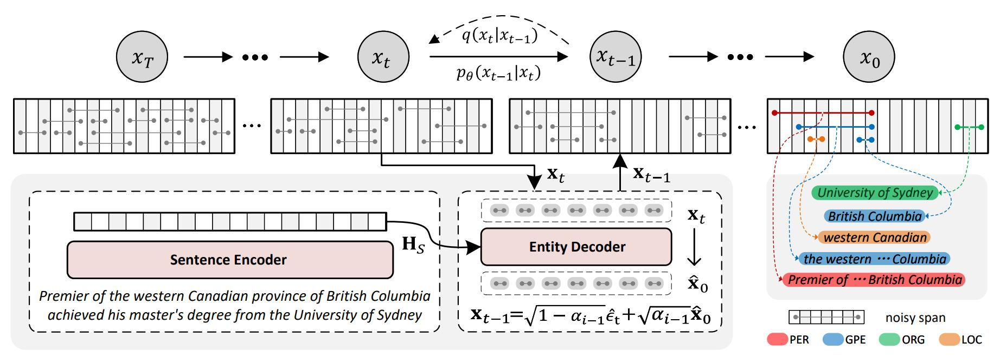

# DiffusionNER

Code for [DiffusionNER: Boundary Diffusion for Named Entity Recognition](https://arxiv.org/abs/2305.13298), Yongliang Shen, Kaitao Song, Xu Tan, Dongsheng Li, Weiming Lu, Yueting Zhuang, ACL 2023.

<p align="center"></p>

During training, DiffusionNER gradually adds noises to the golden entity boundaries by a fixed forward diffusion process and learns a reverse diffusion process to recover the entity boundaries. In inference, DiffusionNER first randomly samples some noisy spans from a standard Gaussian distribution and then generates the named entities by denoising them with the learned reverse diffusion process.

## Setup

To run our code, install:
```
conda create -n diffusionner python=3.8
pip install -r requirements.txt
```

## Quick Start

### Datasets

Nested NER:

+ ACE04: https://catalog.ldc.upenn.edu/LDC2005T09
+ ACE05: https://catalog.ldc.upenn.edu/LDC2006T06
+ GENIA: http://www.geniaproject.org/genia-corpuss

Flat NER:

+ OntoNotes: https://github.com/yhcc/OntoNotes-5.0-NER
+ CoNLL03: https://data.deepai.org/conll2003.zip
+ MSRA: https://github.com/ShannonAI/mrc-for-flat-nested-ner/blob/master/ner2mrc/download.md

We provide the preprocessed datasets in these links: [ACE2004](https://drive.google.com/drive/folders/10DYZGYqYSRFQZUbGs8OhFtAvaVD1FC0D?usp=sharing), [GENIA](https://drive.google.com/drive/folders/1krNw98zi5mp0KPZGoCo5D5ne8dWV6pUD?usp=sharing), [CoNLL03](https://drive.google.com/drive/folders/17BXWQ2W0zzrbYR8W1KAWSCNSYJcoUGiw?usp=sharing), [MSRA](https://drive.google.com/drive/folders/1wt0XTEG3FFl8uiUyTUYxVwQ1i3oZtOHn?usp=sharing). Please download them and put them into the `data/datasets` folder.

If you need other datasets, please contact me (`syl@zju.edu.cn`) by email. Note that you need to state your identity and prove that you have obtained the license.

### Training

Take the ACE2004 dataset as a demo and run:

```
CUBLAS_WORKSPACE_CONFIG=:4096:8 python diffusionner.py train --config configs/ace2004.conf
```

We also provide the pre-trained checkpoints in these links: [ACE2004](https://pan.baidu.com/s/1OpXFOgkhyuD57EXjNrSI_Q?pwd=7869), [GENIA](https://pan.baidu.com/s/1OpXFOgkhyuD57EXjNrSI_Q?pwd=7869), [CoNLL03](https://pan.baidu.com/s/1OpXFOgkhyuD57EXjNrSI_Q?pwd=7869), [MSRA](https://pan.baidu.com/s/1OpXFOgkhyuD57EXjNrSI_Q?pwd=7869). Please download them and put them into the `data/checkpoints` folder.

### Evaluating

Set the path of the model checkpoint into `eval.conf -> model_path`  and run:

```
CUBLAS_WORKSPACE_CONFIG=:4096:8 python diffusionner.py eval --config configs/eval.conf
```

## Citation

If you find this repository useful, please cite our paper:

```
@article{Shen2023DiffusionNERBD,
  title={DiffusionNER: Boundary Diffusion for Named Entity Recognition},
  author={Yongliang Shen and Kaitao Song and Xu Tan and Dong Sheng Li and Weiming Lu and Yue Ting Zhuang},
  journal={ArXiv},
  year={2023},
  volume={abs/2305.13298}
}
```

## Acknowledgement

[denoising-diffusion-pytorch](https://github.com/lucidrains/denoising-diffusion-pytorch)